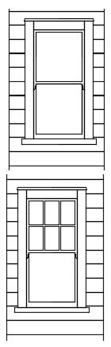
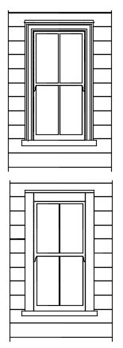
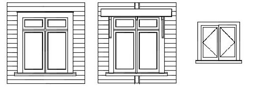
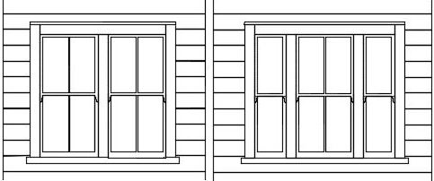

## Introduction ##
To get a good building or to alter an existing building well it is important to have good design. A key skill for a good designer to achieve good results is to have control over the draughting process. It is scale drawings that make a project and that underpin the project decision making. Well planned buildings are essential but elevations too are important in achieving a quality result. Here I am mainly focusing on altering and adding to existing buildings.

*Double hung windows in elevation.*

With the development of computer methods that are based around 3D computer models, that the quality of the 2D drawings, plans and particularly elevations, is in decline. This effect may be built into some of the software packages such as Revit, where for alterations work the components or families available with the software by default do not relate well to what exists on site. This is pronounced when working with the old houses of Auckland, which do not necessarily have close overseas equivalents. 
 
## Drawing a double hung window. ##

A crucial first step is very careful measuring and recording of what exists. Taking the example of traditional window joinery here are some suggestions for the process. Record on site such information as:-

1. the size of the opening 
2. the size of the sash and how much of it is visible 
3. the approximate profile of the sill 
4. the width of the architraves will be important. When measuring the house it is good also to record the height of the rough opening at sill level, above floor level.

As you develop your elevations it is important to have in mind the scale at which they will be reproduced and printed, the size of the scaled output when printed at scale. This will have an influence on how much detail should be including in the drawing. 

The control of lineweight is also important. When multiple lines are very close together a thin line should be used. The use of medium or heavy line weights around the perimeter of the element may also be a good idea, to give your drawings punch and variety.

*Double hung windows.*
 
 A PDF of the image, that can be printed to scale can be obtained from the link. There are also dxf links, at the end of this page. 

[double hung pdf ](../assets/heritage/drawing_joinery/traditional_timber_joinery-double_hung_fancy_architrave.pdf)

To continue the example I would like to carry on the discussion of an output drawing of a double hung window. These are very common and strongly associated with the timber villas of Auckland built about 120 years ago. In representing one of these following points should be noted. 

1. In elevation the main frame of the window will sit behind the architrave and be concealed from view. 
2. The sash rails and stiles will be partially visible and there is generally a variation in depth between the rails at the bottom and the centre. 
3. A fair bit of detail should be left out at a scale 1:100, such as scribers, putty lines and detail associated with the sill profile.

*casement windows - bungalow period.*

## Good draughting practice generally ##
When I first began in architecture, my grandfather, a successful building contractor with an interest in design, gave me a book he had used in designing a house for himself. This book was [Draughtsmanship](https://books.google.co.nz/books/about/Draughtsmanship.html?id=9fm9QAAACAAJ&redir_esc=y) by Fraser Reekie. I still refer to this on occasion and the principles of good drafting practice given here are still valid. Interestingly, with the rise in the internet a wide variety of traditional drafting instruction books are now available for free. Through the Internet archive these have been scanned, and made available for download, as they are out of copyright. Here are links to some of these. 

---
| book | book |
| ------ | ------ |
|[Modern Drafting 1911](https://archive.org/details/moderndrafting00mill) | [Architectural Drawing Plates 1919](https://archive.org/details/ElwoodArchDrawingPlates0001)  |
| [Progressive Steps 1919](https://archive.org/details/cu31924074480520) |  [Primer of Architectural Drawing for Young Students 1910](https://archive.org/stream/aprimerarchitec00danagoog#page/n100/mode/2up) |

## Drawings for download ##
  

*Paired and multiple double hung windows.*
  
These drawings can be used as a starting point when representing a building at the common elevation scale of 1:100. The provided dxf files will work with most cad software.

A further excellent resource, which includes sketch construction detail for traditional windows can be found [here](https://www.renovate.org.nz/villa/windows-doors-other-joinery-and-hardware/windows/), on the Branz Renovate website. 

[traditional_timber_joinery-double_hung_pair](../assets/heritage/drawing_joinery/traditional_timber_joinery-double_hung_pair.pdf)
[traditional_timber_joinery-double_hung_pair dxf](../assets/heritage/drawing_joinery/traditional_timber_joinery-double_hung_pair.dxf)

[traditional_timber_joinery-bungalow_casements](../assets/heritage/drawing_joinery/traditional_timber_joinery-bungalow_casements.pdf)
[traditional_timber_joinery-bungalow_casements dxf](../assets/heritage/drawing_joinery/traditional_timber_joinery-bungalow_casements.dxf)

[traditional_timber_joinery-double_hung_divided_light](../assets/heritage/drawing_joinery/traditional_timber_joinery-double_hung_divided_light.pdf)
[traditional_timber_joinery-double_hung_divided_light dxf](../assets/heritage/drawing_joinery/traditional_timber_joinery-double_hung_divided_light.dxf)

[traditional_timber_joinery-double_hung_fancy_architrave](../assets/heritage/drawing_joinery/traditional_timber_joinery-double_hung_fancy_architrave.pdf)
[traditional_timber_joinery-double_hung_fancy_architrave dxf](../assets/heritage/drawing_joinery/traditional_timber_joinery-double_hung_fancy_architrave.dxf)

